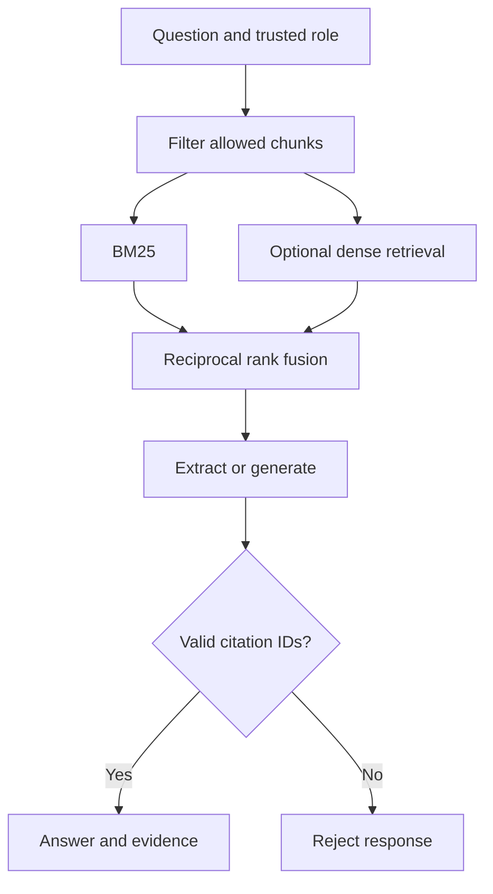

# EvidenceRAG

An access-aware technical knowledge assistant that makes its evidence inspectable.
Ask about a runbook, inspect the retrieved source, and distinguish an unsupported
answer from an accessible result.

## Run it

```bash
python app.py demo
python app.py ask --question "How should we investigate bridge readiness latency?" --role engineer
python app.py ask --question "cobalt otter treasury allocation" --role engineer
python app.py eval
```

The first question returns cited runbook excerpts. The treasury question abstains
because the engineering role cannot access that synthetic finance document.

## Implemented

- Paragraph-aware word windows with stable content-derived chunk IDs.
- Role filtering before retrieval statistics, embedding requests, and model input.
- BM25 lexical retrieval; optional dense retrieval fused by reciprocal rank.
- Extractive offline answers and optional structured model-generated answers.
- Citation membership validation and explicit model abstention.
- A six-case synthetic retrieval smoke evaluation with MRR at 3.

```bash
python app.py ask --question "How should we investigate bridge readiness latency?" \
  --role engineer --model YOUR_GENERATION_MODEL --embedding-model YOUR_EMBEDDING_MODEL
```

## Architecture



## Boundaries

`--role` is a local demonstration input, not authentication. A hosted service must
derive roles from an authenticated identity. Citation membership does not prove
that the cited text supports every generated claim. Embeddings are recomputed per
query, and the dense similarity threshold is an uncalibrated demo heuristic.
There is no vector database, learned reranker, OCR or file-upload service. The
evaluation set is a small smoke set shipped with the demo, not an independent
quality benchmark.

## Verification and scope

```bash
python -m unittest discover -s tests -v
```

Python 3.11+ is required. Runtime and tests use only the standard library.
GitHub Actions is configured for Python 3.11, 3.12 and 3.13; only Python 3.12
was executed during preparation. See [validation](docs/validation.md) and
[recorded demo output](docs/demo-output.json).

The default demo is deterministic and uses synthetic data. The optional Ollama
adapter follows the [generation API](https://docs.ollama.com/api/generate) and
[embedding API](https://docs.ollama.com/api/embed). Adapter contract tests use mock
responses. No live model, cloud service or paid provider was tested. Replace
model placeholders with models already installed in your local Ollama server.

This is a focused reference implementation prepared with AI assistance. It does
not claim production deployment, measured business impact, or enterprise readiness.
Read the [architecture decisions](docs/architecture.md) and
[interview walkthrough](docs/interview.md) before presenting it.
